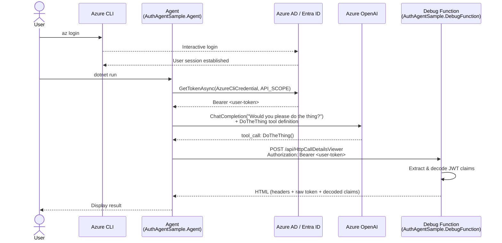

# Agent Authentication Demo

A demonstration solution showing how **credential delegation** works when an AI agent calls a backend API on behalf of a signed-in user.

The solution contains two projects that work together:

| Project | Description |
|---|---|
| [`AbeckDev.AuthAgentSample.Agent`](./AbeckDev.AuthAgentSample.Agent/Readme.md) | A simple AI agent that acquires the current user's token (via Azure CLI) and calls the debug function as that user |
| [`AbeckDev.AuthAgentSample.DebugFunction`](./AbeckDev.AuthAgentSample.DebugFunction/Readme.md) | An Azure Function that logs the full HTTP request details — including the decoded JWT bearer token — and returns them as an HTML page |

---

## How It Works



1. The **Agent** uses `AzureCliCredential` to obtain the currently signed-in user's access token.  
   This is a placeholder for a real OAuth2 / MSAL authentication flow in a production scenario.
2. The agent registers a tool (`DoTheThing`) that calls the **Debug Function** with that token in the `Authorization` header.
3. An AI model (Azure OpenAI) decides to invoke the tool when prompted.
4. The **Debug Function** receives the request, decodes the JWT, and returns everything as a readable HTML page, allowing you to verify that the agent is calling the function *on behalf of* the user.

---

## Project Structure

```
agent-authentication-demo/
├── Readme.md                                        # This file
├── agent-authentication-demo.sln                    # Visual Studio solution
├── AbeckDev.AuthAgentSample.Agent/                  # AI Agent project
│   ├── AbeckDev.AuthAgentSample.Agent.csproj
│   ├── Program.cs                                   # Agent entry point
│   ├── appsettings.json
│   ├── appsettings.Development.json
│   ├── Properties/launchSettings.json
│   └── Readme.md
└── AbeckDev.AuthAgentSample.DebugFunction/          # Azure Function project
    ├── AbeckDev.AuthAgentSample.DebugFunction.csproj
    ├── HttpCallDetailsViewer.cs                     # Function implementation
    ├── Program.cs                                   # Isolated worker entry point
    ├── host.json
    ├── Properties/launchSettings.json
    └── Readme.md
```

---

## Prerequisites

| Tool | Version | Purpose |
|---|---|---|
| [.NET SDK](https://dotnet.microsoft.com/download) | 8.0+ (Function), 9.0+ (Agent) | Build & run both projects |
| [Azure Functions Core Tools](https://learn.microsoft.com/azure/azure-functions/functions-run-local) | v4+ | Run the function locally |
| [Azure CLI](https://learn.microsoft.com/cli/azure/install-azure-cli) | Latest | Authenticate as a user for token acquisition |
| Azure OpenAI resource | — | The agent uses Azure OpenAI to decide when to call the tool |

---

## Getting Started

### 1. Sign in with Azure CLI

```bash
az login
```

The agent uses your active Azure CLI session to acquire a token on your behalf.

### 2. Start the Debug Function

```bash
cd AbeckDev.AuthAgentSample.DebugFunction
func start
```

The function will be available at `http://localhost:7071/api/HttpCallDetailsViewer`.

### 3. Configure the Agent

Set the required environment variables:

```bash
export AZURE_OPENAI_ENDPOINT="https://<your-resource>.openai.azure.com/"
export AZURE_OPENAI_DEPLOYMENT_NAME="gpt-4o-mini"   # optional, this is the default
export API_SCOPE="<your-api-scope>"                  # e.g. https://management.azure.com/.default
```

### 4. Run the Agent

```bash
cd AbeckDev.AuthAgentSample.Agent
dotnet run
```

The agent will acquire a token, ask the AI model to "do the thing", and the model will call the debug function. Check the function's output (or the returned HTML) to see the full request details and decoded JWT.

---

## Configuration Reference

| Variable | Project | Description |
|---|---|---|
| `AZURE_OPENAI_ENDPOINT` | Agent | Azure OpenAI endpoint URL (**required**) |
| `AZURE_OPENAI_DEPLOYMENT_NAME` | Agent | Model deployment name (default: `gpt-4o-mini`) |
| `API_SCOPE` | Agent | OAuth2 scope to request the token for (default: `https://management.azure.com/.default`) |

---

## Contributing

Contributions are welcome! Please open an issue or submit a pull request.

